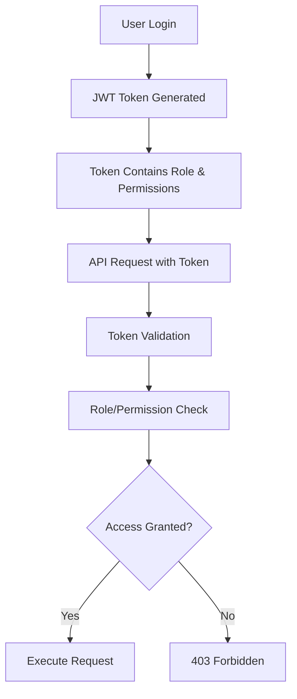

# 🔐 Role-Based Access Control (RBAC) System

## 📋 Overview

The Blood Bank Management System implements a comprehensive **Role-Based Access Control (RBAC)** system that provides fine-grained access control to ensure secure operations and data protection. The system combines **role-based** and **permission-based** authorization to provide flexible security management.

## 🏗️ RBAC Architecture

### 🎭 User Roles Hierarchy

The system defines four primary user roles with increasing levels of access:

```
Admin (Highest Level)
├── Full system access
├── All permissions automatically granted
└── Can manage all users and system settings

Manager (Senior Level)
├── Inventory management
├── Donor management
├── Analytics and reporting
└── Department supervision

Staff (Operational Level)
├── Donor management
├── Basic operations
├── Reports access
└── Data entry/viewing

Viewer (Read-Only Level)
├── View-only access
├── Reports and analytics
├── No data modification
└── Monitoring access
```

### 🔑 Permission System

Each user has specific permissions that can be individually granted:

| Permission | Description | Default Access |
|------------|-------------|----------------|
| `can_manage_inventory` | Manage blood stock, usage records | Admin, Manager |
| `can_manage_donors` | Create/edit blood collections, donor info | Admin, Manager, Staff |
| `can_view_analytics` | Access dashboard and analytics | All roles |
| `can_access_reports` | Generate and view reports | All roles |
| `can_manage_users` | User administration | Admin only |
| `can_view_forecasts` | Access prediction models | All roles |

### 🏢 Department Structure

Users are organized by departments:

- **Blood Bank** - Primary blood bank operations
- **Laboratory** - Testing and processing
- **Clinical** - Patient care and usage
- **Administration** - System administration

## 🛡️ Security Implementation

### 🔐 Authentication Flow



### 🔒 Authorization Mechanisms

The system uses two types of authorization:

#### 1. **Role-Based Authorization**
```python
@app.get("/admin-only-endpoint")
def admin_function(current_user: User = Depends(require_role("admin"))):
    # Only admin users can access this endpoint
```

#### 2. **Permission-Based Authorization**
```python
@app.post("/blood-collections")
def create_collection(current_user: User = Depends(require_permission("can_manage_donors"))):
    # Users with can_manage_donors permission can access
```

## 📊 Role & Permission Matrix

### Complete Access Control Matrix

| Endpoint Category | Endpoint | Admin | Manager | Staff | Viewer | Required Permission |
|------------------|----------|-------|---------|-------|--------|-------------------|
| **Authentication** | | | | | | |
| POST `/auth/register` | ✅ | ✅ | ✅ | ✅ | `Public` |
| POST `/auth/login` | ✅ | ✅ | ✅ | ✅ | `Public` |
| GET `/auth/me` | ✅ | ✅ | ✅ | ✅ | `Authenticated` |
| PUT `/auth/me` | ✅ | ✅ | ✅ | ✅ | `Authenticated` |
| POST `/auth/change-password` | ✅ | ✅ | ✅ | ✅ | `Authenticated` |
| POST `/auth/refresh` | ✅ | ✅ | ✅ | ✅ | `Authenticated` |
| POST `/auth/logout` | ✅ | ✅ | ✅ | ✅ | `Authenticated` |
| GET `/auth/users` | ✅ | ❌ | ❌ | ❌ | `Admin Role` |
| GET `/auth/users/{id}` | ✅ | ❌ | ❌ | ❌ | `Admin Role` |
| PUT `/auth/users/{id}` | ✅ | ❌ | ❌ | ❌ | `Admin Role` |
| DELETE `/auth/users/{id}` | ✅ | ❌ | ❌ | ❌ | `Admin Role` |
| **Blood Collections** | | | | | | |
| POST `/blood-bank/collections` | ✅ | ✅ | ✅ | ❌ | `can_manage_donors` |
| GET `/blood-bank/collections` | ✅ | ✅ | ✅ | ❌ | `can_manage_donors` |
| GET `/blood-bank/collections/{id}` | ✅ | ✅ | ✅ | ❌ | `can_manage_donors` |
| **Blood Usage** | | | | | | |
| POST `/blood-bank/usage` | ✅ | ✅ | ❌ | ❌ | `can_manage_inventory` |
| GET `/blood-bank/usage` | ✅ | ✅ | ✅ | ✅ | `can_access_reports` |
| GET `/blood-bank/usage/{id}` | ✅ | ✅ | ✅ | ✅ | `can_access_reports` |
| **Inventory** | | | | | | |
| GET `/blood-bank/inventory` | ✅ | ✅ | ❌ | ❌ | `can_manage_inventory` |
| GET `/blood-bank/inventory/{blood_group}` | ✅ | ✅ | ✅ | ✅ | `can_view_analytics` |
| **Analytics** | | | | | | |
| GET `/blood-bank/analytics/dashboard` | ✅ | ✅ | ✅ | ✅ | `can_view_analytics` |
| GET `/blood-bank/alerts/low-stock` | ✅ | ✅ | ✅ | ✅ | `can_view_analytics` |
| GET `/blood-bank/alerts/expiry` | ✅ | ✅ | ✅ | ✅ | `can_view_analytics` |
| **System Management** | | | | | | |
| GET `/blood-bank/system/status` | ✅ | ❌ | ❌ | ❌ | `can_manage_users` |
| GET `/health` | ✅ | ✅ | ✅ | ✅ | `Public` |

### Legend
- ✅ **Allowed** - User can access endpoint
- ❌ **Denied** - User cannot access endpoint
- 🔒 **Conditional** - Access depends on additional conditions

## 🚀 Implementation Examples

### **Simplified User Registration with Automatic Permissions**

The system now features **automatic permission assignment** based on user roles during registration. This streamlines the registration process and ensures consistent security policies.

#### Registration Fields Required
Users only need to provide these essential fields:
- `username` - Unique identifier for login
- `email` - Email address for notifications 
- `password` & `confirm_password` - Authentication credentials
- `full_name` - User's display name
- `phone` - Contact phone number (optional)
- `role` - One of: admin, manager, staff, viewer

#### Automatic Permission Assignment Logic
```python
def assign_permissions_by_role(role: str) -> dict:
    """Automatically assign permissions based on user role"""
    role_permissions = {
        "admin": {
            "can_manage_inventory": True,
            "can_view_forecasts": True, 
            "can_manage_donors": True,
            "can_access_reports": True,
            "can_manage_users": True,
            "can_view_analytics": True
        },
        "manager": {
            "can_manage_inventory": True,
            "can_view_forecasts": True,
            "can_manage_donors": True, 
            "can_access_reports": True,
            "can_manage_users": False,
            "can_view_analytics": True
        },
        "staff": {
            "can_manage_inventory": False,
            "can_view_forecasts": True,
            "can_manage_donors": True,
            "can_access_reports": True, 
            "can_manage_users": False,
            "can_view_analytics": True
        },
        "viewer": {
            "can_manage_inventory": False,
            "can_view_forecasts": True,
            "can_manage_donors": False,
            "can_access_reports": True,
            "can_manage_users": False, 
            "can_view_analytics": True
        }
    }
    return role_permissions.get(role.lower(), role_permissions["staff"])
```

### 1. **Creating Users with Simplified Registration**

#### Admin User
```bash
curl -X POST "http://localhost:8000/api/v1/auth/register" \
  -H "Content-Type: application/json" \
  -d '{
    "username": "admin_user",
    "email": "admin@bloodbank.com",
    "full_name": "System Administrator",
    "password": "AdminPass123!",
    "confirm_password": "AdminPass123!",
    "phone": "+1234567890",
    "role": "admin"
  }'
```
**Result:** User created with ALL permissions automatically assigned

#### Manager User
```bash
curl -X POST "http://localhost:8000/api/v1/auth/register" \
  -H "Content-Type: application/json" \
  -d '{
    "username": "manager_user",
    "email": "manager@bloodbank.com",
    "full_name": "Blood Bank Manager",
    "password": "ManagerPass123!",
    "confirm_password": "ManagerPass123!",
    "phone": "+1234567891",
    "role": "manager"
  }'
```
**Result:** User created with inventory, donors, reports, and analytics permissions (no user management)

#### Staff User
```bash
curl -X POST "http://localhost:8000/api/v1/auth/register" \
  -H "Content-Type: application/json" \
  -d '{
    "username": "staff_user",
    "email": "staff@bloodbank.com",
    "full_name": "Blood Bank Staff",
    "password": "StaffPass123!",
    "confirm_password": "StaffPass123!",
    "phone": "+1234567892",
    "role": "staff"
  }'
```
**Result:** User created with donor management, reports, and analytics permissions (no inventory or user management)

#### Viewer User
```bash
curl -X POST "http://localhost:8000/api/v1/auth/register" \
  -H "Content-Type: application/json" \
  -d '{
    "username": "viewer_user",
    "email": "viewer@bloodbank.com",
    "full_name": "System Viewer",
    "password": "ViewerPass123!",
    "confirm_password": "ViewerPass123!",
    "phone": "+1234567893",
    "role": "viewer"
  }'
```
**Result:** User created with read-only access (reports and analytics only)

### Benefits of Automatic Permission Assignment
- **Consistency**: All users with the same role have identical permissions
- **Security**: No manual permission assignment reduces human error
- **Simplicity**: Streamlined registration process
- **Maintainability**: Role-permission mapping is centralized and easy to update

### 2. **Legacy Registration Examples (Deprecated)**

> **⚠️ Note**: The following examples show the old manual permission assignment method, which is now deprecated in favor of automatic assignment.

### 1. **Creating Users with Different Roles (Legacy)**

#### Admin User
```bash
curl -X POST "http://localhost:8000/api/v1/auth/register" \
  -H "Content-Type: application/json" \
  -d '{
    "username": "admin_user",
    "email": "admin@bloodbank.com",
    "full_name": "System Administrator",
    "password": "AdminPass123!",
    "confirm_password": "AdminPass123!",
    "role": "admin",
    "department": "Administration",
    "can_manage_inventory": true,
    "can_manage_donors": true,
    "can_view_analytics": true,
    "can_access_reports": true,
    "can_manage_users": true
  }'
```

#### Manager User
```bash
curl -X POST "http://localhost:8000/api/v1/auth/register" \
  -H "Content-Type: application/json" \
  -d '{
    "username": "manager_user",
    "email": "manager@bloodbank.com",
    "full_name": "Blood Bank Manager",
    "password": "ManagerPass123!",
    "confirm_password": "ManagerPass123!",
    "role": "manager",
    "department": "Blood Bank",
    "can_manage_inventory": true,
    "can_manage_donors": true,
    "can_view_analytics": true,
    "can_access_reports": true,
    "can_manage_users": false
  }'
```

#### Staff User
```bash
curl -X POST "http://localhost:8000/api/v1/auth/register" \
  -H "Content-Type: application/json" \
  -d '{
    "username": "staff_user",
    "email": "staff@bloodbank.com",
    "full_name": "Blood Bank Staff",
    "password": "StaffPass123!",
    "confirm_password": "StaffPass123!",
    "role": "staff",
    "department": "Blood Bank",
    "can_manage_inventory": false,
    "can_manage_donors": true,
    "can_view_analytics": true,
    "can_access_reports": true,
    "can_manage_users": false
  }'
```

#### Viewer User
```bash
curl -X POST "http://localhost:8000/api/v1/auth/register" \
  -H "Content-Type: application/json" \
  -d '{
    "username": "viewer_user",
    "email": "viewer@bloodbank.com",
    "full_name": "System Viewer",
    "password": "ViewerPass123!",
    "confirm_password": "ViewerPass123!",
    "role": "viewer",
    "department": "Administration",
    "can_manage_inventory": false,
    "can_manage_donors": false,
    "can_view_analytics": true,
    "can_access_reports": true,
    "can_manage_users": false
  }'
```

### 2. **Testing Access Control**

#### Get Authentication Token
```bash
# Login and get token
LOGIN_RESPONSE=$(curl -s -X POST "http://localhost:8000/api/v1/auth/login" \
  -H "Content-Type: application/json" \
  -d '{"username": "staff_user", "password": "StaffPass123!"}')

TOKEN=$(echo $LOGIN_RESPONSE | python3 -c "import json,sys; print(json.load(sys.stdin)['access_token'])")
```

#### Test Allowed Operation (Staff creating blood collection)
```bash
curl -X POST "http://localhost:8000/api/v1/blood-bank/collections" \
  -H "Authorization: Bearer $TOKEN" \
  -H "Content-Type: application/json" \
  -d '{
    "donor_id": "DONOR_001",
    "donor_name": "John Doe",
    "donor_age": 30,
    "donor_gender": "M",
    "blood_type": "O+",
    "collection_site": "Main Hospital",
    "donation_date": "2025-07-31T10:00:00",
    "expiry_date": "2025-09-05T10:00:00",
    "collection_volume_ml": 450.0,
    "hemoglobin_g_dl": 14.5
  }'
```
**Expected:** ✅ Success (201 Created)

#### Test Forbidden Operation (Staff trying to manage inventory)
```bash
curl -X POST "http://localhost:8000/api/v1/blood-bank/usage" \
  -H "Authorization: Bearer $TOKEN" \
  -H "Content-Type: application/json" \
  -d '{
    "purpose": "transfusion",
    "department": "Emergency",
    "blood_group": "O+",
    "volume_given_out": 300.0,
    "time": "2025-07-31T10:00:00",
    "individual_name": "Patient X",
    "patient_location": "Emergency Ward"
  }'
```
**Expected:** ❌ Forbidden (403 Access Denied)

## 🔍 Access Control Validation

### Permission Check Flow

1. **Token Validation**
   ```python
   # JWT token is validated for authenticity
   current_user = decode_and_validate_token(token)
   ```

2. **Role Check (if required)**
   ```python
   if required_role and current_user.role != required_role:
       if current_user.role != "admin":  # Admin bypasses role checks
           raise HTTPException(403, "Access denied")
   ```

3. **Permission Check (if required)**
   ```python
   if not getattr(current_user, permission):
       if current_user.role != "admin":  # Admin has all permissions
           raise HTTPException(403, "Access denied")
   ```

### Admin Privilege Escalation

**Admins automatically bypass all role and permission checks:**
- Admin users have access to all endpoints regardless of specific permissions
- This ensures system administration is always possible
- Follows the principle of administrative override

## 🛡️ Security Best Practices

### 1. **Principle of Least Privilege**
- Users receive only the minimum permissions needed for their role
- Permissions can be individually adjusted for specific users
- Regular permission audits should be conducted

### 2. **Defense in Depth**
- Multiple layers of security (authentication + authorization)
- Role-based and permission-based checks
- Department-based access restrictions

### 3. **Audit and Monitoring**
- All authentication attempts are logged
- Permission checks are recorded
- Failed access attempts trigger alerts

### 4. **Token Security**
- JWT tokens have configurable expiration times
- Tokens include user ID, role, and permissions
- Refresh tokens available for extended sessions

## 🔧 Customizing Access Control

### Adding New Permissions

1. **Add permission to user model:**
   ```python
   # In app/models/user.py
   can_new_feature = Column(Boolean, default=False)
   ```

2. **Add to user schema:**
   ```python
   # In app/schemas/user.py
   can_new_feature: bool = False
   ```

3. **Use in endpoint:**
   ```python
   @router.post("/new-feature")
   def new_feature(current_user: User = Depends(require_permission("can_new_feature"))):
       # Implementation
   ```

### Creating Custom Role Checks

```python
def require_manager_or_admin():
    def check_role(current_user: User = Depends(get_current_user)) -> User:
        if current_user.role not in ["manager", "admin"]:
            raise HTTPException(403, "Manager or Admin role required")
        return current_user
    return check_role
```

## 📋 Common Access Patterns

### 1. **Public Endpoints**
```python
@router.post("/public-endpoint")
def public_function():
    # No authentication required
```

### 2. **Authenticated Endpoints**
```python
@router.get("/authenticated-endpoint")
def auth_function(current_user: User = Depends(get_current_user)):
    # Any authenticated user can access
```

### 3. **Role-Restricted Endpoints**
```python
@router.delete("/admin-only")
def admin_function(current_user: User = Depends(require_role("admin"))):
    # Only admin role can access
```

### 4. **Permission-Restricted Endpoints**
```python
@router.post("/inventory-management")
def inventory_function(current_user: User = Depends(require_permission("can_manage_inventory"))):
    # Only users with specific permission can access
```

## 🚨 Error Handling

### Access Denied Responses

#### 401 Unauthorized
```json
{
  "detail": "Not authenticated"
}
```
**Cause:** Missing or invalid JWT token

#### 403 Forbidden (Role)
```json
{
  "detail": "Access denied. Required role: admin"
}
```
**Cause:** User lacks required role

#### 403 Forbidden (Permission)
```json
{
  "detail": "Access denied. Required permission: can_manage_inventory"
}
```
**Cause:** User lacks required permission

## 📚 Integration Examples

### Frontend Integration (React)

```javascript
// Check user permissions before showing UI elements
const UserComponent = ({ user }) => {
  const canManageInventory = user.permissions?.can_manage_inventory;
  
  return (
    <div>
      {canManageInventory && (
        <InventoryManagementPanel />
      )}
      <ReadOnlyDashboard />
    </div>
  );
};
```

### API Client (Python)

```python
class BloodBankClient:
    def __init__(self, token):
        self.headers = {"Authorization": f"Bearer {token}"}
    
    def create_collection(self, data):
        # This will fail if user lacks can_manage_donors permission
        response = requests.post(
            "http://localhost:8000/api/v1/blood-bank/collections",
            json=data,
            headers=self.headers
        )
        if response.status_code == 403:
            raise PermissionError("Insufficient permissions")
        return response.json()
```

## 🔒 Conclusion

The Blood Bank Management System's RBAC implementation provides:

- ✅ **Granular Control** - Fine-grained permissions for specific operations
- ✅ **Scalability** - Easy to add new roles and permissions
- ✅ **Security** - Multiple layers of access control
- ✅ **Flexibility** - Role and permission-based authorization
- ✅ **Audit Trail** - Complete logging of access attempts
- ✅ **Admin Override** - Administrative access when needed

This comprehensive access control system ensures that sensitive blood bank operations are properly secured while maintaining operational efficiency for authorized users.

---

**🩸 Blood Bank Management System RBAC** - Secure, scalable, and healthcare-compliant access control.

*Documentation updated: July 31, 2025*
