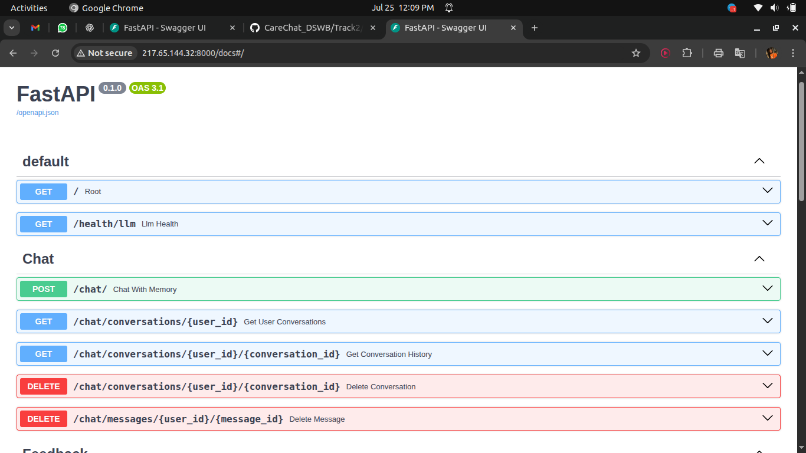

# CareChat Track 2 - AI-Powered Healthcare Chat System

## 🏥 Overview

CareChat Track 2 is a comprehensive healthcare chat application that combines the power of multiple AI models with Retrieval-Augmented Generation (RAG) to provide clinically-informed medical assistance. The system features a FastAPI backend with intelligent conversation management and a Flutter mobile frontend for seamless user experience.

## 🏗️ Architecture

```
CareChat Track 2/
├── Backend/                 # FastAPI REST API Server
│   ├── app/                 # Core application code
│   ├── Data/                # RAG datasets and embeddings
│   └── requirements.txt     # Python dependencies
└── Frontend/                # Flutter mobile application
    ├── android/             # Android-specific files
    ├── ios/                 # iOS-specific files
    ├── lib/                 # Flutter source code
    └── pubspec.yaml         # Flutter dependencies
```

## 🧠 Key Features

### 🤖 Multi-LLM Support
- **Primary**: Google Gemini 2.0-flash for high-quality responses
- **Fallback**: Support for additional LLM providers
- **Smart Routing**: Automatic provider selection based on availability

### 📚 RAG-Enhanced Responses
- **Clinical Knowledge Base**: 50,000+ medical case summaries
- **Intelligent Retrieval**: Automatic medical context detection
- **Disease Coverage**: COVID-19, Malaria, Typhoid, Anemia, Dengue, Hepatitis
- **Fast Performance**: Cached embeddings for instant responses

### 💬 Advanced Conversation Management
- **Persistent Memory**: Maintains context across chat sessions
- **Multi-User Support**: Individual conversation histories
- **Session Management**: Multiple concurrent conversations per user
- **Context Awareness**: Intelligent context window management

### 🔐 Secure Authentication
- **JWT-Based Auth**: Secure token-based authentication
- **User Management**: Registration, login, profile management
- **Password Security**: Bcrypt hashing with salt
- **Session Control**: Configurable token expiration

### 📱 Cross-Platform Mobile App
- **Flutter Framework**: Single codebase for iOS and Android
- **Native Performance**: Compiled to native code
- **Responsive Design**: Adaptive UI for different screen sizes
- **Offline Capability**: Local data caching (when implemented)

## 🚀 Quick Start

### Prerequisites
- **Backend**: Python 3.8+, PostgreSQL (production) or SQLite (development)
- **Frontend**: Flutter SDK 3.8.1+, Dart SDK
- **API Keys**: Google AI API key for Gemini

### Backend Setup

1. **Navigate to Backend Directory**
```bash
cd Backend
```

2. **Create Virtual Environment**
```bash
python -m venv venv
source venv/bin/activate  # Linux/Mac
# or venv\Scripts\activate  # Windows
```

3. **Install Dependencies**
```bash
pip install -r requirements.txt
```

4. **Environment Configuration**
Create `.env` file in Backend directory:
```env
# AI Configuration
GOOGLE_API_KEY=your_gemini_api_key_here
MODEL_NAME=gemini-2.0-flash

# Database Configuration
DATABASE_URL=sqlite:///./carechat.db

# JWT Security
SECRET_KEY=your-super-secret-jwt-key-change-in-production
ALGORITHM=HS256
ACCESS_TOKEN_EXPIRE_MINUTES=30
```

5. **Start the Server**
```bash
uvicorn app.main:app --reload
```

The backend server will start on `http://localhost:8000`

## 🌐 Live Demo

### 🔗 Live API Documentation
The CareChat Track 2 backend is currently deployed and accessible at:
- **Live API Base URL**: `http://217.65.144.32:8000`
- **Interactive Swagger UI**: [`http://217.65.144.32:8000/docs/`](http://217.65.144.32:8000/docs/)

The Swagger UI provides an interactive interface where you can:
- 📖 Browse all available API endpoints
- 🧪 Test endpoints directly in the browser
- 📋 View request/response schemas
- 🔐 Test authentication flows
- 💬 Try the chat functionality with sample data


### 🎥 Video Demo

Watch the backend in action:

[](assets/videos/backend_demo.mp4)

> **Note**: Click the thumbnail to play the video.

### 📸 What You'll See in the Swagger Interface

When you visit the live Swagger UI, you'll find these main endpoint categories:

#### 🔐 **Authentication Endpoints** (`/auth`)
- `POST /auth/register` - Register new users
- `POST /auth/login` - User authentication
- User management and JWT token handling

#### 💬 **Chat Endpoints** (`/chat`)
- `POST /chat/` - Main chat interface with RAG integration
- `GET /chat/conversations/{user_id}` - Retrieve conversation history
- `GET /chat/conversation/{conversation_id}` - Get specific conversation
- Multi-LLM support with conversation memory

#### 👤 **Patient Management** (`/api/patient`)
- Patient data management endpoints
- Healthcare information handling

#### 📝 **Feedback System** (`/feedback`)
- `POST /feedback/` - Submit user feedback
- Rating and review collection

#### 🔍 **System Health** 
- `GET /` - Welcome message
- `GET /health/llm` - LLM service status
- System monitoring endpoints

> **🚀 Try it yourself**: Visit [`http://217.65.144.32:8000/docs/`](http://217.65.144.32:8000/docs/) to interact with the live API!

> **Note**: Visit the live Swagger interface to explore the API without setting up the backend locally!

### Frontend Setup

1. **Navigate to Frontend Directory**
```bash
cd Frontend
```

2. **Install Flutter Dependencies**
```bash
flutter pub get
```

3. **Run the App**
```bash
# For Android emulator/device
flutter run

# For iOS simulator (macOS only)
flutter run -d ios

# For web (development)
flutter run -d web
```

## 📊 System Components

### Backend Components

#### 🎯 API Endpoints (`app/api/`)
- **`chatbot.py`**: Multi-LLM chat with RAG integration
- **`auth.py`**: User authentication and authorization
- **`patient.py`**: Patient data management
- **`feedback.py`**: User feedback and rating system

#### 🧩 Core Services (`app/services/`)
- **`llm_service.py`**: Multi-LLM provider management
- **`rag_service.py`**: Retrieval-Augmented Generation system
- **`conversation_service.py`**: Chat memory and context management

#### 🗄️ Data Models (`app/models/`)
- **`user.py`**: User account management
- **`conversation.py`**: Chat conversation storage
- **`feedback.py`**: User feedback and ratings

#### 🔧 Configuration (`app/core/`)
- **`config.py`**: Application settings and environment variables
- **`jwt_auth.py`**: JWT token management
- **`auth.py`**: Authentication utilities

### Frontend Components

#### 📱 Flutter Application
- **Material Design**: Modern, accessible UI components
- **State Management**: Efficient app state handling
- **HTTP Integration**: RESTful API communication
- **Navigation**: Smooth page transitions and routing

## 🧪 Testing the System

### Health Check
```bash
# Local development
curl http://localhost:8000/health/llm

# Live API
curl http://217.65.144.32:8000/health/llm
```

### Test Chat Endpoint
```bash
# Local development
curl -X POST "http://localhost:8000/chat/" \
  -H "Content-Type: application/json" \
  -d '{
    "message": "What are the symptoms of malaria?",
    "user_id": 1,
    "conversation_id": null
  }'

# Live API
curl -X POST "http://217.65.144.32:8000/chat/" \
  -H "Content-Type: application/json" \
  -d '{
    "message": "What are the symptoms of malaria?",
    "user_id": 1,
    "conversation_id": null
  }'
```

### Test Authentication
```bash
# Register new user (Local)
curl -X POST "http://localhost:8000/auth/register" \
  -H "Content-Type: application/json" \
  -d '{
    "username": "testuser",
    "email": "test@example.com",
    "password": "testpass123"
  }'

# Register new user (Live API)
curl -X POST "http://217.65.144.32:8000/auth/register" \
  -H "Content-Type: application/json" \
  -d '{
    "username": "testuser",
    "email": "test@example.com",
    "password": "testpass123"
  }'

# Login user (Local)
curl -X POST "http://localhost:8000/auth/login" \
  -H "Content-Type: application/json" \
  -d '{
    "username": "testuser",
    "password": "testpass123"
  }'

# Login user (Live API)
curl -X POST "http://217.65.144.32:8000/auth/login" \
  -H "Content-Type: application/json" \
  -d '{
    "username": "testuser",
    "password": "testpass123"
  }'
```

### 🌐 Interactive Testing
For the easiest testing experience, visit the **live Swagger UI**: [`http://217.65.144.32:8000/docs/`](http://217.65.144.32:8000/docs/)

This interactive interface allows you to test all endpoints without using curl commands!

## 🔍 RAG System Details

### How RAG Works
1. **Query Analysis**: Detects medical keywords in user messages
2. **Context Retrieval**: Searches clinical database for relevant cases
3. **Context Integration**: Combines retrieved information with user query
4. **Enhanced Response**: LLM generates response with clinical grounding

### Performance Optimization
- **Embedding Cache**: Pre-computed embeddings stored in `Data/` directory
- **Fast Startup**: 2-3 seconds for subsequent runs (vs 30-60s first run)
- **Intelligent Triggering**: RAG only activates for medical queries
- **Memory Efficient**: Uses FAISS for efficient similarity search

### Dataset Information
- **Test Dataset**: 1,000 clinical summaries (for development)
- **Full Dataset**: 50,000 clinical summaries (for production)
- **Format**: CSV with structured medical case data
- **Update Process**: Automatic cache regeneration when data changes

## 📱 Mobile App Features

### User Interface
- **Chat Interface**: Intuitive messaging experience
- **Message History**: Persistent conversation storage
- **User Profile**: Account management and settings
- **Medical Disclaimer**: Clear usage guidelines

### Technical Features
- **Real-time Updates**: Live chat functionality
- **Offline Support**: Cached conversations (when implemented)
- **Push Notifications**: Medical reminders (when implemented)
- **Biometric Auth**: Secure app access (when implemented)

## 🚀 Deployment

### Backend Deployment Options

#### Option 1: Render (Recommended)
1. Connect GitHub repository
2. Set environment variables in Render dashboard
3. Use build command: `pip install -r requirements.txt`
4. Use start command: `uvicorn app.main:app --host 0.0.0.0 --port $PORT`

#### Option 2: Docker
```dockerfile
FROM python:3.9-slim
WORKDIR /app
COPY requirements.txt .
RUN pip install -r requirements.txt
COPY . .
EXPOSE 8000
CMD ["uvicorn", "app.main:app", "--host", "0.0.0.0", "--port", "8000"]
```

### Frontend Deployment

#### Mobile App Stores
```bash
# Build for Android
flutter build apk --release

# Build for iOS (macOS only)
flutter build ios --release
```

#### Web Deployment
```bash
flutter build web
# Deploy dist files to web hosting service
```

## 🔒 Security Considerations

### Backend Security
- **JWT Authentication**: Secure token-based auth
- **Password Hashing**: Bcrypt with salt
- **CORS Configuration**: Proper cross-origin settings
- **Input Validation**: Pydantic schema validation
- **SQL Injection Protection**: SQLAlchemy ORM

### Frontend Security
- **Secure Storage**: Encrypted local data storage
- **API Key Protection**: No hardcoded secrets
- **HTTPS Only**: Secure communication protocols
- **Input Sanitization**: User input validation

## 📚 Documentation

- **Backend README**: [`Backend/README.md`](./Backend/README.md) - Detailed backend documentation
- **API Documentation (Local)**: Available at `http://localhost:8000/docs` (Swagger UI)
- **API Documentation (Live)**: Available at [`http://217.65.144.32:8000/docs/`](http://217.65.144.32:8000/docs/) - Live Swagger UI Interface
- **RAG Documentation**: [`Backend/RAG_README.md`](./Backend/RAG_README.md)
- **Chat API Guide**: [`Backend/CHAT_API_DOCUMENTATION.md`](./Backend/CHAT_API_DOCUMENTATION.md)
- **Deployment Guide**: [`Backend/DEPLOYMENT_CHECKLIST.md`](./Backend/DEPLOYMENT_CHECKLIST.md)

## 🤝 Contributing

### Development Workflow
1. **Fork the Repository**: Create your own copy
2. **Create Feature Branch**: `git checkout -b feature/your-feature`
3. **Make Changes**: Follow existing code patterns
4. **Test Thoroughly**: Ensure all components work together
5. **Submit Pull Request**: Include detailed description

### Code Standards
- **Backend**: Follow PEP 8 Python style guide
- **Frontend**: Follow Dart/Flutter conventions
- **Documentation**: Update README files for new features
- **Testing**: Include unit tests for new functionality

### Adding Medical Data
1. Add new cases to `Backend/Data/clinical_summaries.csv`
2. Delete embedding cache files to force rebuild
3. Test with relevant medical queries
4. Update documentation if new conditions are added

## 🔧 Troubleshooting

### Common Issues

#### Backend Issues
- **Slow Startup**: Normal on first run (generating embeddings)
- **Missing API Key**: Check `.env` file for `GOOGLE_API_KEY`
- **Database Errors**: Verify `DATABASE_URL` configuration
- **RAG Not Working**: Ensure clinical data files exist

#### Frontend Issues
- **Build Failures**: Run `flutter clean && flutter pub get`
- **API Connection**: Verify backend URL in app configuration
- **Platform Issues**: Check Flutter and platform-specific setup

### Performance Monitoring
- **API Response Times**: Monitor chat endpoint latency
- **RAG Performance**: Track embedding cache hit rates
- **Token Usage**: Monitor Gemini API consumption
- **Database Performance**: Track query execution times

## 🎯 Roadmap

### Near Term
- [ ] Complete Flutter UI implementation
- [ ] Add real-time messaging with WebSockets
- [ ] Implement user feedback analytics
- [ ] Add medical disclaimer and safety warnings

### Medium Term
- [ ] Multi-language support
- [ ] Voice input/output capabilities
- [ ] Integration with wearable devices
- [ ] Advanced medical terminology support

### Long Term
- [ ] AI-powered health assessments
- [ ] Integration with electronic health records
- [ ] Telemedicine consultation features
- [ ] Advanced analytics and reporting

## 📞 Support

For technical support or questions:
- Create an issue in the GitHub repository
- Review existing documentation in the `Backend/` directory
- Check the API documentation at `http://localhost:8000/docs`

## ⚠️ Important Disclaimers

- **Not Medical Advice**: This system is for informational purposes only
- **Professional Consultation**: Always consult healthcare professionals for medical decisions
- **Emergency Situations**: Call emergency services for urgent medical needs
- **Data Privacy**: Ensure compliance with healthcare data regulations (HIPAA, GDPR)

---

## 🎉 Quick Start Summary

```bash
# Backend
cd Backend
python -m venv venv && source venv/bin/activate
pip install -r requirements.txt
# Create .env file with your API keys
uvicorn app.main:app --reload

# Frontend (in another terminal)
cd Frontend
flutter pub get
flutter run
```

### 🌐 Or Try the Live API
Instead of setting up locally, you can immediately test the live API at:
- **Swagger UI**: [`http://217.65.144.32:8000/docs/`](http://217.65.144.32:8000/docs/)
- **Base API**: `http://217.65.144.32:8000`

Your CareChat Track 2 system is now ready for development and deployment! 🚀
